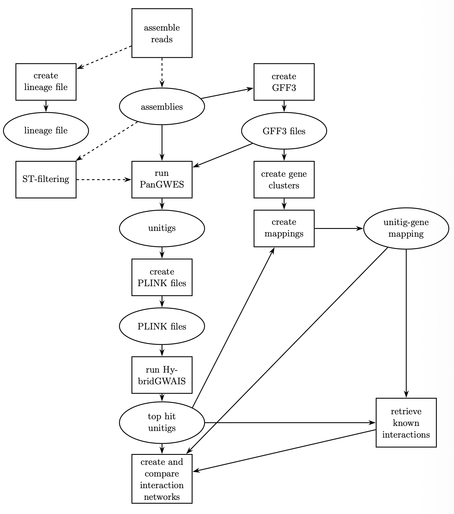

# Pipeline structure and tools

# Pipeline structure
The pipeline stars by assembling the paired-end reads with Shovill. Those assemblies are then used to crete GFF3-files with Bakta, for potential ST-filtering and as input for the PanGWES pipeline. PanGWES itself uses Cuttlefish to create unitigs and Spydrpick and their own unitig_distance to correct for LD and population structure. Those unitigs are then converted into PLINK format using PLINK, which serves as input for the epistasis detection with HybridGWAIS. The results are then mapped back to Panaroo gene-clusters using BLAST+. Those gene clusters are created using Panaroo and the GFF3-files as inputs. The mappings are then compared to similar networks from the STRING and BioGRID databases.
The whole process is visualized here:

# Underlying tools
- [Shovill](https://github.com/tseemann/shovill): A fast bacterial genome assembler that wraps multiple underlying assemblers ([SKESA](https://doi.org/10.1186/s13059-018-1540-z), [SPAdes](https://doi.org/10.1002/cpbi.102) and [MEGAHIT](https://doi.org/10.1093/bioinformatics/btv033)).
- [Bakta](https://doi.org/10.1099/mgen.0.000685): A bacterial genome annotation tool that predicts and annotates coding sequences, non-coding RNAs, regulatory elements, and repeat sequences.
- [PanGWES](https://doi.org/10.1101/gr.278485.123): A tool extending Spydrpicks LD and population structure correction capabilities to unitigs. The underlying third party tools are:
    - [Cuttlefish](https://doi.org/10.1093/bioinformatics/btab309): Builds a colored compacted de Bruijn graph from multiple genome assemblies, which nodes represent unitigs.
    - [SpydrPick](https://doi.org/10.1093/nar/gkz656): Calculates mutual information (MI) between all pairs of loci in the presence/absence alignment and identifies statistically significant co-evolving pairs using the Tukey outlier method. Additionally uses sample reweighting for population structure correction an th ARCANE algorithm to remove indirect MI associations.
- [HybridGWAIS](https://doi.org/10.1093/bioadv/vbag172): A GPU-accelerated tool for exhaustive pairwise epistasis detection using, in the case of MicrobialGWES, logistic regression.
- [BLAST+](https://doi.org/10.1186/1471-2105-10-421): The NCBI Basic Local Alignment Search Tool for nucleotide sequences.
- [Panaroo](https://doi.org/10.1186/s13059-020-02090-4): A graph-based pan-genome pipeline that clusters homologous genes across multiple bacterial genomes and corrects for annotation errors.
- [STRING](https://doi.org/10.1093/nar/gkae1113): A database of known and predicted protein-protein interactions for thousands of organisms.
- [BioGRID](https://doi.org/10.1093/nar/gkj109): A manually curated database of protein and genetic interactions from published literature.